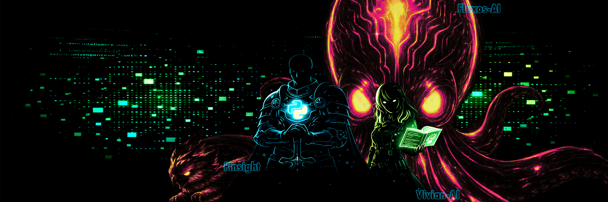

  

# Olá, eu sou o Jhonanthan Bahia 👋

> * Apaixonado por Inteligência Artificial, automação e vivendo o mundo de Python com IA.*

---

## 🧠 Sobre mim

Somente um entusiasta descobrindo o caminho da perdição em python em IA, se tornando o que muitos programadores não desejam para seu pior inimigo - Um Vibe Coding

---

## 🚀 Projeto em destaque

### 🎙️ [Vivian AI](https://github.com/jeduardo.bahia/Vivian-Ai)
> Assistente virtual por voz — modular, open-source e com personalidade própria.

Vivian foi projetada para ser **direta, objetiva e natural**. Integra:
- 🧩 **Ollama** — LLM local para processamento de linguagem
- 🗣️ **ElevenLabs + Edge TTS** — síntese de voz híbrida
- 🏗️ Arquitetura modular pensada para **colaboração e evolução contínua**

---

## 🛠️ Tecnologias

---

## 📬 Contato

---

  Construindo um projeto de cada vez. 🛠️

